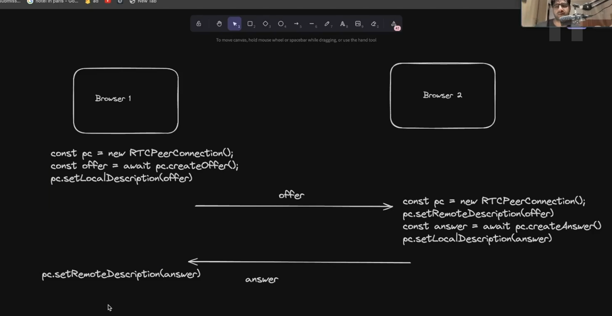
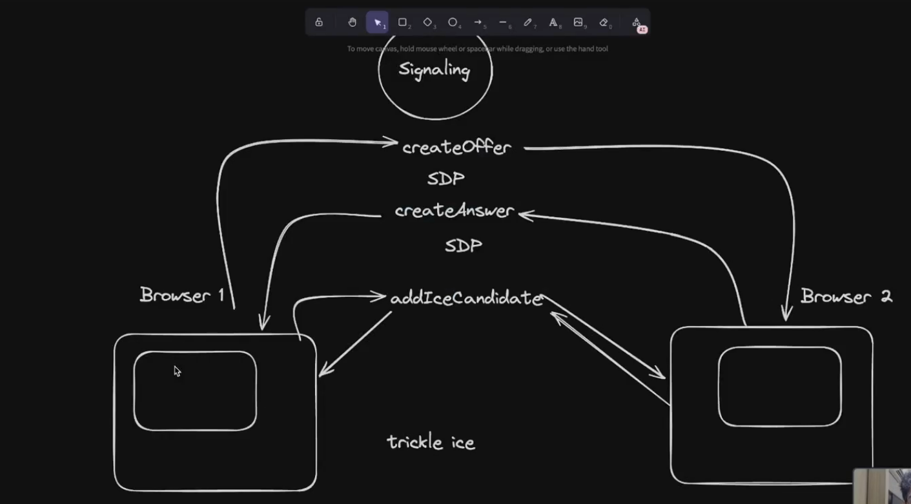

Signaling server -> connects both the IP's 
STUN - it shows your IP

Ice candidates - ICE (Interactive Connectivity Establishment) candidates are potential networking endpoints that WebRTC uses to establish a connection between peers. Each candidate represents a possible method for two devices (peers) to communicate, usually in the context of real-time applications like video calls, voice calls, or peer-to-peer data sharing.


```angular2html

Connecting the two sides
The steps to create a webrtc connection between 2 sides includes - 
 
Browser 1 creates an RTCPeerConnection
Browser 1 creates an offer
Browser 1 sets the local description to the offer
Browser 1 sends the offer to the other side through the signaling server
Browser 2 receives the offer from the signaling server
Browser 2 sets the remote description to the offer
Browser 2 creates an answer
Browser 2 sets the local description to be the answer
Browser 2 sends the answer to the other side through the signaling server
Browser 1 receives the answer and sets the remote description
 
This is just to establish the p2p connection b/w the two parties
 
To actually send media, we have to 
Ask for camera /mic permissions
Get the audio and video streams
Call addTrack on the pc
This would trigger a onTrack callback on the other side
 

```



